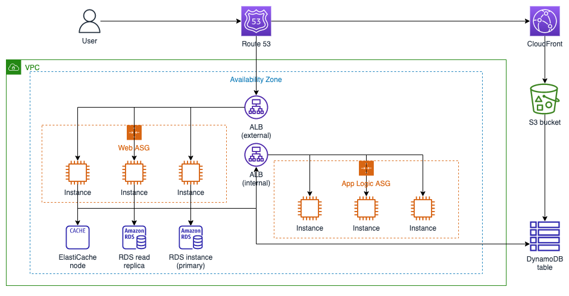
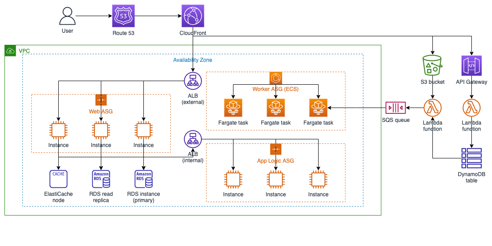

# system_architecture

This note describe/share my thoughts to solve this e-commerce site issue

# SOA, microservices and serverless, Users > 1m

When you reach the one million users threshold, you will need to slightly change your perspective. Traditionally, an application was coded as a whole, and the user interface, business logic, data layers, etc., were intertwined in a giant block. Nowadays, this is called a monolithic app, and it is very hard to manage, especially with high amounts of traffic. Development is hard, and each little change affects everything, so there is no flexibility.

Service-oriented architecture (SOA) fixes most of the issues that originate from monolithic architecture. It can be defined as a way to make software components reusable and interoperable via service interfaces. Think about an e-commerce app, where you can separate authentication, product search, order process, recommendation, product catalog, and order DBs as different services. This concept is also called loose coupling. You can reuse some of the components with SOA; for example, you can use the authentication service with another application you are developing. Your development process is also easier, as different teams can work on different services, and separate deployments can be pushed for each component. One of the key advantages of SOA in cloud environments is the ability to scale services separately. For example, during a big traffic event, you can scale up your search and order services but keep your recommendation service the same.

With loose coupling, we could convert our architecture [diagram/diagram-1]to something similar to the diagram below (the second AZ is omitted for simplicity):

The next step from SOA is microservices. While SOA is a big improvement over monolithic architecture, there is still some component sharing and dependencies between services. Microservices are fine-grained, more independent, and loosely coupled services. Comparing the two, SOA is larger and more modular. Architecturally, SOA services can be thought of as separate EC2 instances, while microservices are a better fit in containerized environments.

Containers are another big trend in the industry. A container is a standard unit of software that packages up code and all its dependencies like runtime, system tools, system libraries, and settings. Compared to a virtual machine (VM), containers are more:

·     Lightweight: They don’t include an OS, they are faster to boot up, and they can be as small as a couple of MBs.

·     Portable: Containers can be run anywhere with a container engine, and they will run the same every time because their dependencies are packaged with them.

·     Secure: Greater isolation capabilities.

·     Scalable: With the help of a container orchestrator like Kubernetes, hundreds of new containers can be provisioned much quicker than VMs.

AWS has two services for container orchestration, Elastic Container Service (ECS) and Elastic Kubernetes Service (EKS). ECS is simpler to set up and manage, but for more complex workloads and taking advantage of Kubernetes components, EKS is the way to go.

Another concept we need to talk about before proceeding is serverless, which is a cloud-native development model that allows developers to build and run applications on-demand without managing servers and paying only for usage. Of course, there are servers behind it, but they are all managed by the cloud provider and abstracted away from the developer. AWS has many serverless offerings: Lambda for running serverless functions, Fargate for serverless containers, API Gateway for API building, SNS for messaging, SQS for queueing, EventBridge for event-bus, S3 for object storage, DynamoDB for NoSQL database, and many more.

With the help of Amazon’s serverless products, one final concept we can talk about is event-driven computing, which is the concept of triggering functions according to some events. Think about an image processing app. You upload a file from the user interface, wait for a while, and you get the processed image back. In the background, the process happens like this:

·     Image is uploaded to S3

·     An S3:PutObject event is generated on EventBridge

·     Event is pushed to SQS queue

·     Image process Lambda is triggered

·     Processed image is uploaded to S3.

Making use of EventBridge, SNS, SQS, Step Functions, API Gateway, DynamoDB, and such, you can build completely serverless, cloud-native applications.

Below is our architecture after introducing some containerized and serverless components: [diagram/giagram-2]

Here are some key takeaways that combine all of these concepts:

·     Loose coupling sets you free: The more independent your components, the bigger they can scale.

·     Don’t reinvent the wheel: While designing your app, don’t waste effort on components that already exist; for example, instead of writing a queue service or managing your own third-party queue tool, use SQS instead.

·     Go serverless when you can: AWS serverless products can implicitly scale without you thinking about it. Furthermore, you don’t manage the infrastructure, so you can focus on the app logic.
